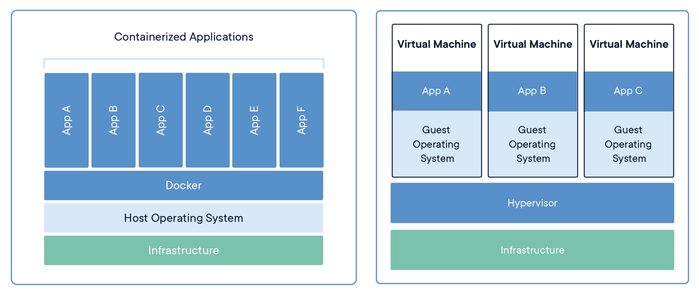

# Cloud Computing, Virtualisation and HPC workflow

- [Cloud Computing, Virtualisation and HPC workflow](#cloud-computing-virtualisation-and-hpc-workflow)
- [Intro](#intro)
- [Cloud Computing](#cloud-computing)
- [Data Centers & Clusters](#data-centers--clusters)
- [Virtualisation](#virtualisation)
  - [Hypervisor](#hypervisor)
- [Containers](#containers)
- [Remote systems and HPC workflow](#remote-systems-and-hpc-workflow)
  - [Job Scheduling](#job-scheduling)
- [Summary](#summary)
- [Sources](#sources)
# Intro

The 'cloud', 'containers', 'data centers', etc. What are these things really, how do they work?

# Cloud Computing

The cloud, is simply another computer, somewhere in the world, that you have some access to. These computers are usually managed by an external company (e.g. Google, Amazon, Microsoft). This is in contrast to the 'old' way of doing things, where you bought many many servers and put them inside your physical building, in a specialised server room.

Many new (and older) companies now prefer using the cloud over on premise solutions, due to a few reasons:

- You need much less technical expertise to use a cloud service than you do when buying and configuring your own servers.
- It's often easier to upgrade, and try out different hardware, because you didn't physically buy the hardware and you are basically just renting it.
- It can be cheaper. If you don't use your servers 24/7, then it might be cheaper to only pay for what you use.
- You can also start smaller and scale faster. If you only have 10 customers, you can rent a super small instance and that would be enough, but when your customer base grows, you can add in more resources with the click of a button.

There are potential downsides too though:

- If you want very fine grained control over your hardware / infrastructure and how everything connects together, often your only choice is to buy your own hardware.
- You always keep on paying for what you use, and it's not a once-off cost of buying the hardware. It might thus be cheaper, in some cases, to not use the cloud.

# Data Centers & Clusters

What is a data center? Simply put, it is many computers in a temperature controlled room. Tasks are scheduled by users and resources are allocated to perform these tasks.

Clusters are similar, but are more often used for scientific applications, or research, and often have very high bandwidth, low latency interconnect between different machines, and are very well suited to run code across many machines.

# Virtualisation

Now, when provisioning these cluster resources, you often have quite fine grained control over what hardware you can use, e.g. X number of CPUs, Y GBs of RAM, etc.

But, the data centers don't contain all of these combinations of hardware, so what do we do? 

Answer: Virtualisation. The idea here is to have relatively strong machines, and then create smaller virtual machines with the specified configuration (e.g. using VirtualBox on a larger scale).

## Hypervisor

What is a hypervisor? This term is often used in conjunction with VMs and the cloud. A hypervisor is basically just a program that manages the created and loaded VMs and schedules how their work will be performed by the physical CPU.

# Containers

What are containers? You can almost think of them as 'lite' virtual machines, that virtualise the operating system instead of the entire hardware as VMs do. They can be modified (by for example installing programs / tools) and easily shared.

Containers are useful to create a consistent environment across different machines (e.g. having preinstalled all the necessary tools to start with a project)

https://www.docker.com/resources/what-container

# Remote systems and HPC workflow

Basically everyone that works on HPC use remote systems, called clusters. These are usually massive data-center like buildings with many machines inside them. They can be accessed by ssh-ing into the management node, usually called the head node or login node. This is a central point from which users can log in, and schedule their jobs.

These jobs can basically be any program, and is often run using 

## Job Scheduling

Clusters usually work through the principle of job scheduling, where users specify 

1. what they want to run
2. how many resources they require (e.g. 5 nodes, or 128 cores or 512GB memory, or 2 GPUs, etc)
3. The maximum time they think it will run for.

Then, a program, called a job scheduler (for example [Slurm](https://slurm.schedmd.com/documentation.html) or [PBS](https://www.openpbs.org/)), takes all of these requests and puts them into a queue, and allocates resources to jobs when they are available.

This is a much better solution than simply letting everyone run code on any machine at any time, because the scheduler enforces constraints, doesn't run too many jobs on one node, and ensures everyone gets a fair share.

# Summary

In summary, we covered the basics of cloud computing, virtualisation, clusters and job scheduling.

# Sources

- [https://www.docker.com/resources/what-container](https://www.docker.com/resources/what-container)
- [https://www.redhat.com/en/topics/virtualization/what-is-a-hypervisor](https://www.redhat.com/en/topics/virtualization/what-is-a-hypervisor)